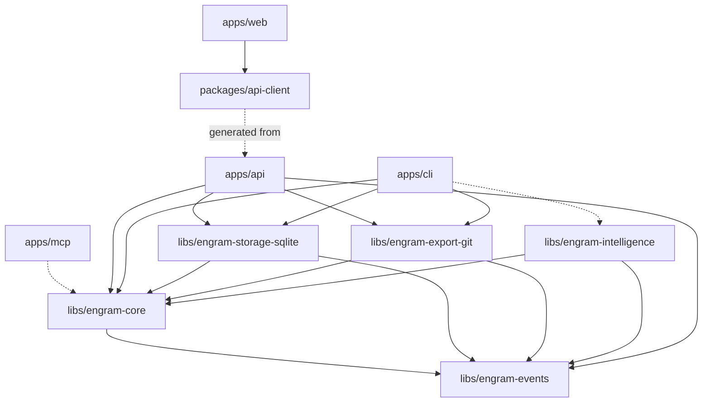

# engram Architecture

This is the master architecture document. It covers the whole system at survey depth and
links to focused documents for detail. If you change something this document contradicts,
either your change or this document is wrong — fix whichever it is in the same PR.

- **[The Memory Model](memory-model.md)** — the most load-bearing document: twelve typed
  kinds, the justification spine, lifecycle, decay, conflicts, graph semantics
- **[Intelligence](intelligence.md)** — how AI enters: the ingestion pipeline, provider
  abstraction, versioned prompts, and the evaluation gate
- [Domain model](domain-model.md) · [Events](events.md) · [Data flow](data-flow.md)
- [REST API](api.md) · [Conventions](conventions.md) · [Operations](operations.md)
- [Security](security.md) · [Roadmap](roadmap.md) · [Decisions (ADRs)](adr/)

## 1. What engram is

A local-first, user-owned memory engine for AI assistants. Multiple assistants (ChatGPT,
Claude, Gemini, Cursor, Copilot, Ollama, …) share one persistent memory through REST and
MCP interfaces. The user owns the data: it is an event log they can replay, a SQLite file
they can query, and a git repository of markdown they can read anywhere, forever.

## 2. The load-bearing decisions

### Three storage concerns, three canonical layers ([ADR-0001](adr/0001-three-layer-storage.md))

```
Conversations / Assistants / CLI / Web
              │  commands
              ▼
        Memory Engine (application services)
              │  appends
              ▼
   EVENT LOG — append-only, system of record (SQLite `events` table)
              │  projected into
   ┌──────────┼──────────────────┐
   ▼          ▼                  ▼
SQLite      Search index       Markdown export
state       (FTS / vectors,    (.md + frontmatter)
tables      later)                   │ committed by
                                     ▼
(canonical runtime state)      Git repository
                               (canonical history, portable, user-owned)
```

| Concern | Canonical layer | Why |
| --- | --- | --- |
| Runtime state & queries | SQLite projections | Search, graph traversal, decay, dedup, analytics are database operations |
| Portable representation | Markdown + frontmatter | Human-readable, greppable, tool-agnostic, user-owned |
| History | Git (+ NDJSON event export) | Versioning is what git is phenomenal at; NDJSON makes history machine-replayable |

Portability invariant: `git clone <export-repo>` + `engram rebuild` reconstitutes the full
SQLite state losslessly. This becomes a CI-tested round-trip once implementations land.

### Event sourcing from day 1 ([ADR-0002](adr/0002-event-sourcing.md))

There is no `UPDATE memories` anywhere. Commands are validated by aggregates, which emit
immutable events; the current state is a fold over the log. Undo, replay, audit trails,
timelines, and retroactive analytics are structural consequences, not features.

### Immutable identity ([ADR-0003](adr/0003-immutable-uuid-identity.md))

A memory *is* its UUIDv7. Slug and filename are mutable projections. Nothing may address a
memory by path.

### Event-driven subsystem communication ([ADR-0004](adr/0004-engram-events-kernel.md))

State changes flow through the log; projections subscribe. Reads are plain synchronous
calls against projections — the bus is not an RPC mechanism.

## 3. Monorepo & folder structure

Turborepo + pnpm orchestrate both languages; Python packages are uv workspace members with
minimal `package.json` shims so `turbo lint/typecheck/test` covers everything.

```
engram/
├── apps/
│   ├── api/        FastAPI shell (routers, schemas, DI wiring, error mapping)
│   ├── cli/        Typer shell (`engram` command)
│   ├── mcp/        MCP server (deliberately empty until roadmap phase 7)
│   └── web/        Next.js 15 dashboard (App Router, Tailwind v4, shadcn/ui)
├── packages/
│   ├── api-client/ TS client generated from the OpenAPI contract (openapi-fetch)
│   ├── config-ts/  Shared tsconfig bases
│   └── ui/         Shared components (wired, empty until a second surface needs it)
├── libs/
│   ├── engram-events/          Kernel: envelope, registry, serde, bus/store/projection contracts
│   ├── engram-core/            Domain (aggregates, values, events, errors, ports) + application services
│   ├── engram-storage-sqlite/  Canonical store: event log + state projections + Alembic
│   ├── engram-export-git/      Markdown/NDJSON exporter, git committer, inbound reconciler
│   ├── engram-intelligence/    AI layer: ingestion pipeline contracts, LLM provider port,
│   │                           versioned prompts, eval harness (SDKs confined to providers/)
│   └── engram-observatory/     Explainability: decision traces (the audit graph, ADR-0015)
├── evaluations/    Golden cases, synthetic corpus spec, committed baseline (ADR-0014)
├── docs/           This documentation + ADRs
├── docker/         Optional container setup (local-first: not required)
└── .github/        CI, templates, dependabot
```

## 4. Package boundaries & dependency graph



The rule is **imports point inward**: `apps → adapters → core → events`. It is enforced,
not aspirational: `import-linter` runs the layers contract in CI (see root
`pyproject.toml`), and the TS side uses workspace dependency declarations. engram-core
knows nothing about SQLite, git, HTTP, or files; engram-events knows nothing about engram.

Everything crosses boundaries through **ports** (`engram_core/domain/ports.py` —
`MemoryRepository`, `MemoryQuery`, `SearchIndex`, `EmbeddingProvider`, `MarkdownSync`,
`VersionControl`, `Clock`) or the kernel contracts (`EventStore`, `EventBus`,
`Projection`). Adapters are replaceable per port; the DI composition root in each app
(`apps/api/src/engram_api/dependencies.py`) is the only place that names implementations.
This is also the future plugin seam: a plugin is an adapter registered at the composition
root.

## 5. Data flow

See [data-flow.md](data-flow.md) for diagrams. In one paragraph: a command arrives at an
interface (API/CLI/MCP), the application service loads the aggregate (replays its stream),
the aggregate validates and emits events, the event store appends them atomically with an
optimistic-concurrency check on the stream sequence, the in-process bus fans them out to
projections (state tables, later search index and markdown export), and reads are ordinary
synchronous queries against projections.

## 6. Domain model

The model of record is [memory-model.md](memory-model.md): memories are **typed
objects** — twelve kinds (fact, preference, person, organization, project, skill, goal,
contact, event, location, asset, relationship) realized as versioned attribute schemas
over one event-sourced **Memory** aggregate (ADR-0008), each carrying the justification
spine (source, evidence, confidence, importance, lifetime, visibility — ADR-0009).
**Proposal** is the second aggregate: PR-style review, and the vehicle for pruning
(ADR-0011) and future extraction. Mechanics in [domain-model.md](domain-model.md); the
event vocabulary in [events.md](events.md).

## 7. API layout

See [api.md](api.md). `/api/v1` with plural nouns, cursor pagination, RFC 9457
problem+json errors, optimistic concurrency surfaced as 409. The OpenAPI schema is the
contract; `pnpm gen:client` regenerates `packages/api-client` and CI fails on drift.

## 8. Naming conventions & coding standards

See [conventions.md](conventions.md). Highlights: strict mypy and strict TypeScript, Ruff
+ Biome as the only formatters, events named `<Noun><PastTense>`, `ENGRAM_*` env vars,
Conventional Commits.

## 9. Error handling, logging, configuration

See [operations.md](operations.md). One `EngramError` hierarchy defined in the domain;
adapters translate inward, interfaces map outward exactly once (problem+json / exit
codes). structlog everywhere except the domain layer (which emits events instead).
pydantic-settings in apps only, precedence `init > env > .env > config.toml > defaults`.

## 10. Build pipeline & testing

- `pnpm lint` → Ruff + Biome; `pnpm run lint:architecture` → import-linter contracts
- `pnpm typecheck` → mypy (strict) + tsc, orchestrated by turbo with caching
- `pnpm test` → pytest (markers: `unit` = pure, `integration` = tmp SQLite/git) + Vitest
- `pnpm build` → `next build` + `uv build`
- Event-sourced house test style: *given* events → *when* command → *then* events.
  Replay determinism (same log ⇒ same projection state) is a standing invariant.
- Coverage gate (once implementations land): 85% on engram-core and engram-events.

## 11. CI, Docker, local development, editor

- **GitHub Actions** ([ci.yml](../.github/workflows/ci.yml)): path-filtered `python`,
  `node`, and `contract` (OpenAPI drift) jobs; all required; concurrency-cancel per ref.
- **Docker** ([docker/](../docker/)): multi-stage uv image for the API, Next standalone
  image for the web app, compose file that mounts `ENGRAM_DATA_DIR`. Optional by design —
  the blessed path is bare `pnpm dev`.
- **Local setup**: Node 22+, pnpm 9+, uv. `pnpm install && uv sync --all-packages`, then
  `pnpm dev` (API :8000, web :3000). uv provisions Python 3.13 itself. Windows-safe.
- **VSCode** ([.vscode/](../.vscode/)): Ruff + Biome as per-language format-on-save,
  pytest discovery, launch configs for API debugging.

## 12. Security

See [security.md](security.md). Local-first threat model: loopback-only API by default,
no auth yet (deliberate, with a reserved `get_principal()` seam), memory content treated
as untrusted LLM input, slug alphabet + path resolution guard against traversal, export
repo treated like a secrets vault.

## 13. License

Apache-2.0. The explicit patent grant matters for AI-adjacent infrastructure, and it is
the ecosystem norm for tools meant to be embedded by other projects. (MIT was the simpler
alternative; the trade-off is recorded here deliberately.)

## 14. Self-critique — known weaknesses and their mitigations

An architecture review of this architecture. These are real risks, ranked.

1. **Event sourcing is the biggest complexity bet.** Schema evolution, replay cost, and
   contributor unfamiliarity are recurring failure modes of ES systems. Mitigations:
   `schema_version` + upcaster registry exist from day 1 (kernel); projection checkpoints
   make rebuilds incremental; snapshots are reserved as a pure optimization in ADR-0002;
   CONTRIBUTING.md teaches the given/when/then test idiom. At personal-memory scale
   (thousands of events, not billions) replay cost is a non-issue for years.
2. **Markdown two-way sync is now the hardest subsystem.** With SQLite canonical, a direct
   file edit must be detected, parsed, validated, and appended as events — a mini sync
   engine with conflict semantics. Contained: it is one port (`MarkdownSync`), one adapter
   package, and deliberately deferred to roadmap phase 4 so the event core stabilizes
   first. The fallback if it proves intractable: export stays one-way and external edits
   become proposals a human approves in the dashboard.
3. **"Everything through events" can over-decouple.** Explicitly bounded: writes flow
   through the log, reads are synchronous calls. The bus is in-process and synchronous
   until profiling says otherwise. Async infrastructure without a measured need is
   forbidden by ADR-0004.
4. **SQLite-canonical weakens the "it's just files" story** compared to a git-canonical
   design. Recovered by the NDJSON event export: the repo carries both human-readable
   state and machine-replayable history, and clone+rebuild is contractually lossless. If
   that invariant is ever violated, it is a release-blocking bug, not a docs footnote.
5. **Concurrency is single-writer-ish.** SQLite WAL handles multi-process access, but the
   export repo needs a write lock around commits, and two processes appending to one
   stream will race (resolved by optimistic concurrency, surfaced as 409/retry). Long
   term, a small daemon should own a memory space; the ports make that a topology change,
   not a rewrite.
6. **Dual-language monorepo doubles the toolchain burden.** Accepted in ADR-0006 because
   the alternatives (Node-only backend, or Python-only with a server-rendered UI) cost
   more where this project needs strength. Mitigated: one-command setup, turbo as the
   single entry point, CI path-filtering so frontend contributors never run Python.
7. **SQLModel is the least mature dependency** and moves slowly relative to Python
   releases. Confined to engram-storage-sqlite behind ports; the event store is nearly raw
   SQL anyway; swapping to plain SQLAlchemy touches one package.
8. **sqlite-vec distribution is rough on Windows** (loadable extension packaging). The
   `SearchIndex` port therefore exposes `supports_vectors` as a capability flag — FTS-only
   installations must remain first-class forever.
9. **The Proposal aggregate may over-abstract.** It re-implements a little of what git
   branches give for free, but against the event log rather than files. If it leaks,
   ADR-0002 records the fallback: proposals become plain draft events with an
   approve/discard bit.
10. **turbo binary compatibility**: turbo is pinned to exactly 2.5.4 — newer builds crash
    with STATUS_ILLEGAL_INSTRUCTION on CPUs without newer instruction sets. Revisit when
    upstream publishes baseline-CPU builds.
