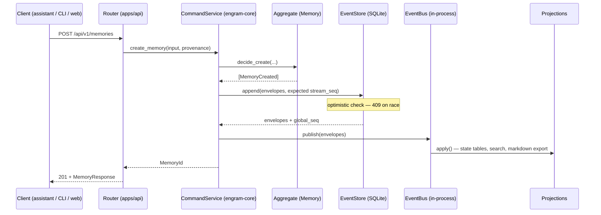

# Data Flow

## Command (write) path



The bus is synchronous: when the request returns, projections have applied the events.

## Query (read) path

Reads never touch aggregates or the bus:

```
client → router → QueryService → projection tables (SQLite) → DTO → response
```

## Rebuild

```
engram rebuild:
  for each projection: reset()
  for envelope in event_store.read_all(after_global_seq=0):
      for projection that handles(envelope.event_type): apply(envelope)
```

Deterministic by contract — same log, same state, every time. This is what makes every
projection disposable and every schema migration of a projection safe (drop + replay).

## Undo

Undo appends the *compensating* event (e.g. re-tag what was untagged, restore what was
archived). History only grows; `git revert` semantics, not `git reset`.

## Export / import (portability)

```
export:  events → markdown files (state) + .engram/events/*.ndjson (history) → git commit
import:  git clone → reconciler seeds the event log from NDJSON → rebuild projections
```

Round-trip losslessness is a standing invariant (release-blocking if violated).

## External edits

The user edits a markdown file by hand → reconciler diffs the working tree against the
manifest → produces candidate `MemoryEditedExternally` envelopes → they append through the
normal command path (same validation, same conflict rules). Files never write to the
database behind the log's back.
